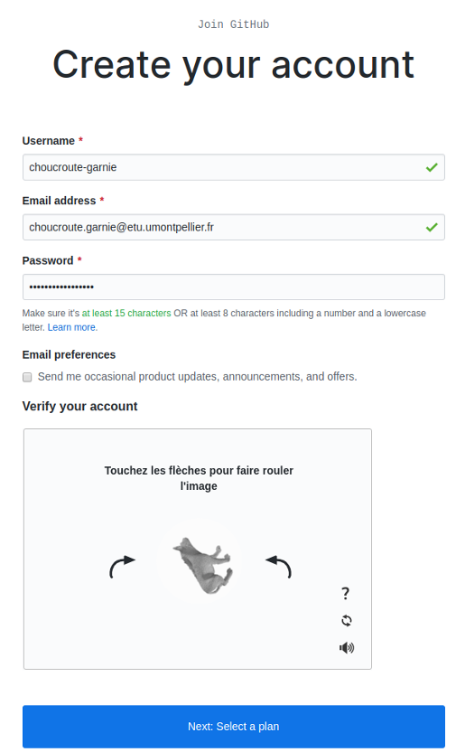
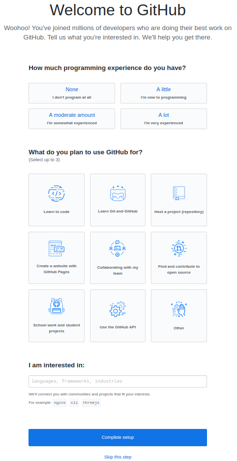

# 

# Développement Orienté Objets

### IUT Montpellier-Sète – Département Informatique

* [**Support de cours**](https://gitlabinfo.iutmontp.univ-montp2.fr/dev-objets/Ressources)
* **Enseignants:**
[Malo Gasquet](mailto:malo.gasquet@umontpellier.fr),
[Sophie Nabitz](mailto:sophie.nabitz@univ-avignon.fr),
[Cyrille Nadal](mailto:cyrille.nadal@umontpellier.fr)
[Victor Poupet](mailto:victor.poupet@umontpellier.fr),
[Gilles Trombettoni](mailto:gilles.trombettoni@umontpellier.fr),
[Petru Valicov](mailto:petru.valicov@umontpellier.fr)
* Le [forum Piazza](https://piazza.com/class/lrahb0patze3u4) de ce cours pour poser vos questions
* [Email](mailto:petru.valicov@umontpellier.fr) pour toute question concernant le cours.

<!--Avant de démarrer le TP, vérifiez que vous n'avez pas atteint votre quota d'espace de stockage autorisé :

* placez-vous dans votre `$HOME` et utilisez les commandes suivantes :
    * `du -sh` pour voir combien d'espace vous avez déjà utilisé
    * `du -sh *` pour voir combien d'espace vous avez déjà utilisé pour chaque fichier (sans fichiers cachés)
    * `du -sch .[!.]* *` pour voir combien d'espace vous avez déjà utilisé pour chaque fichier, y compris les fichiers cachés
* Supprimez les fichiers inutiles.
* Pour éviter des problèmes durant vos TPs d'informatique, vous devriez toujours **garder 300-400 Mo d'espace libre**.
-->

Les instructions de ce TP et de ceux qui vont suivre sont destinés pour les utilisateurs Linux (Ubuntu ou autre). Nous vous encourageons d'utiliser Linux car pour plusieurs cours vous en aurez besoin plus tard et plus généralement en tant qu'informaticien, c'est important d'être familiarisé avec.
Si tout de même, vous préférez utiliser Windows ou Mac OS, une adaptation est possible, mais cela vous demandera un peu de travail de votre côté. Discutez-en avec votre chargé de TD avant de démarrer le TP !

## TP 1 : Rappels de Git

L'objectif de la première partie de ce TP est de vous rappeler les concepts principaux liés à la [gestion de version](https://fr.wikipedia.org/wiki/Gestion_de_versions) avec [Git](https://git-scm.com/). Cet outil vous sera indispensable durant l'apprentissage de ce cours et dans d'autres matières durant votre cursus. En effet, au-delà de la **programmation orientée objets** (l'objectif pédagogique principal du cours), en tant que futur développeur, vous devriez apprendre à être organisé et à collaborer avec d'autres développeurs. <!-- Vous apprendrez également à ne pas réinventer la roue : l'informatique est aujourd'hui une science très riche, donc savoir se faire assister par des outils informatiques est essentiel. Pour beaucoup d'entre vous ce TP sera la première occasion de se confronter à l'utilisation d'un [IDE](https://fr.wikipedia.org/wiki/Environnement_de_d%C3%A9veloppement), aux [tests unitaires](https://fr.wikipedia.org/wiki/Test_unitaire) et à des outils de gestion de cycle de vie logiciel.-->

Nous allons utiliser la plateforme collaborative [GitLab](https://gitlabinfo.iutmontp.univ-montp2.fr/) du département informatique de l'IUT Montpellier-Sète. Normalement, vous vous êtes déjà familiarisé au Semestre 1. Pendant ce module, vous allez principalement écrire du code pour vous-même et qui sera partagé avec vos enseignants. Lorsque vous allez travailler sur le **projet** à plusieurs vous allez pouvoir mesurer tout le potentiel d'un gestionnaire de version. Car tout l'intérêt de travailler avec Git c'est de pouvoir __collaborer__ de manière organisée.


<!--#### Création d'un compte Github

Rendez-vous sur la page d'accueil de [GitHub](https://github.com/) :


Cliquez sur _Sign Up_ et dans la page qui apparaît, inscrivez votre nom d'utilisateur. Celui-ci doit être **obligatoirement** composé de votre prénom et de votre nom séparé par le caractère '-'. Si un utilisateur avec ce nom existe déjà, ajoutez un chiffre à la fin pour éviter les doublons.
Dans le champ _Email Adress_ indiquez votre **adresse universitaire**. Attention : il est important que l'adresse soit universitaire afin de pouvoir bénéficier des avantages liés à votre statut d'étudiant.



Une fois le mot de passe renseigné, cliquez sur le bouton _Next: Select a plan_. Sur l'écran suivant, vous choisirez l'option de base (qui coûte 0 dollars). Le troisième et dernier écran d'enregistrement vous demande des informations sur votre profil. Indiquez que vous êtes un étudiant et que vous comptez utiliser GitHub pour des projets étudiants :



Une fois ces informations renseignées vous pouvez cliquer sur _Complete Setup_ pour définitivement créer votre compte. N'oubliez pas de valider votre adresse email en allant cliquer sur le lien reçu dans votre boîte mail.

#### Paramétrage de votre compte GitHub

Maintenant que votre compte est créé, il faut personnaliser votre profil. GitHub, en plus de vous fournir un moyen simple
et efficace de conserver votre code en ligne, est aussi un réseau social de développeurs. Pour que votre profil puisse
être valorisé un jour dans votre carrière pro, vous devez correctement renseigner vos informations.

#### Demande du "Student Pack" (optionnel)

Si vous le souhaitez, vous pouvez demander une remise académique vous permettant de bénéficier de nombreux avantages : des licences gratuites pour différents logiciels, possibilité d'avoir un nombre illimité de collaborateurs sur un projet privé, des outils d'intégration continue, etc. Pour obtenir la licence académique il faut vous rendre sur la page suivante : https://education.github.com/pack

Cliquez sur le bouton "Get your pack" et certifiez que vous êtes bien un étudiant. Vérifiez les informations vous concernant et validez le formulaire pour terminer cette demande. Généralement la validation de la demande intervient dans l'heure, mais il peut arriver que ça prenne plus de temps donc pas d'inquiétude. Même si on vous conseille d'avoir le Student Pack, ce n'est pas obligatoire pour pouvoir réaliser les TPs.
-->

#### Prise en main de Git

Git est installé sur les postes Linux du département informatique de l'IUT Montpellier-Sète. Voici comment l'installer sur votre machine en fonction de votre système d'exploitation :
* Ubuntu ou une Debian : `sudo apt install git-all`
* une autre distribution Linux : https://git-scm.com/download/linux
* Windows : [Git for Windows](https://gitforwindows.org/)
* Mac OS : https://git-scm.com/download/mac

**Configuration locale de Git**

Si ce n'est pas déjà fait, configurez correctement Git sur votre machine. Pour faire cela sur Linux, ouvrez le fichier `~/.gitconfig` avec votre éditeur de texte favori et renseignez votre nom, prénom et email dans la section `[user]`.
```
# Personnalisez les champs ci-dessous!
[user]
username = choucroute-garnie
name = Choucroute Garnie
email = choucroute.garnie@etu.umontpellier.fr
```

Une autre façon de faire (qui marche sur tous les systèmes) :
```
git config --global user.name "Choucroute Garnie"
git config --global user.email choucroute.garnie@etu.umontpellier.fr
```

Si vous ne l'avez pas fait, pensez à faire le [Tutoriel Git](https://gitlabinfo.iutmontp.univ-montp2.fr/valicov/tutoGit1ereAnnee) de l'IUT, afin de poursuivre le TP.

Voici une petite recap pour voir si vous avez bien suivi :

* C'est quoi un _depôt Git_ ?
* Qu'est-ce qu'un _fork_ Git ?
* Quelle est la différence entre Git et GitLab/GitHub ?
* Que fait `git clone` ?
* Quelle est la différence entre `git add` et `git commit` ? Pourquoi avoir séparé les deux commandes ?
* À quoi correspond le raccourci `git push` ?
* À quoi correspond le raccourci `git pull` ?
* Qu'est-ce qu'un _conflit_ Git ?


<!--Ultérieurement, lorsque vous aurez oublié tout ce que le tuto vous a appris, vous pourrez utiliser ce mini [document](https://www.lirmm.fr/~pvalicov/Cours/archives/Aix/M2104/Demarrer%20avec%20Git) qui résume les fonctionnalités principales de Git.-->

### Création de vos forks
Le rendu et le suivi de votre travail passeront par GitLab. Dans le groupe [Dev-Objets](https://gitlabinfo.iutmontp.univ-montp2.fr/dev-objets/), un sous-groupe qui vous est destiné a normalement été créé par les enseignants. Le sous-groupe doit s'appeler `etu/votreUsername` Ce sous-groupe est privé (seuls vous et les enseignants y ont accès). Il contiendra tous les forks dédiés à vos TPs. Celui du TP1 y est déjà. Cette façon de faire permet d'une part de centraliser et uniformiser les rendus de chaque étudiant et, d'autre part, aux enseignants de suivre et aider plus facilement chaque étudiant en interagissant directement sur son dépôt.

Vous allez cloner le fork GitLab '*dev-objets/etu/votreUsername/tp1*' sur votre machine (dans un répertoire `Dev-Objets` par exemple) et travailler désormais localement tout en _"versionnant"_ votre code et en poussant régulièrement vos réalisations.

### À faire pour chaque exercice
Une fois qu'un exercice sera terminé, n'oubliez pas de pousser vos modifications sur votre fork de la manière suivante (dans cet exemple, on suppose que vous êtes sur la branche `main`) :
```sh
~/Dev-Objets/tp1$ git add fichiers_que_vous_avez_modifié
~/Dev-Objets/tp1$ git commit -m "Validation de l'exercice 1"
~/Dev-Objets/tp1$ git push origin main
```

**Remarque importante** : Rappelez-vous qu'un dépôt contient uniquement les fichiers nécessaires pour qu'un collaborateur puisse reconstruire le projet dans son propre environnement, et surtout _rien de plus_. Donc aucune information personnelle, aucun résultat de compilation, aucune configuration de son propre environnement de travail, ...

#### Exercice 1 -- Un petit Salut le Monde qui va bien !
Complétez la méthode principale de la classe `HelloWorld` (du répertoire [Exercice 1](Exercice1)) en faisant afficher le message _"Salut le monde"_.
1. Dans un terminal, compilez, exécutez et vérifiez votre programme.
2. Versionnez l'intégralité de votre travail avec `git add .` + `git commit`.
3. Faites un `git push` sur le dépôt distant GitLab et comparez avec votre répertoire local. Quelle différence constatez-vous entre votre dépôt local et celui distant ? Pourquoi ?

En règle générale une séparation entre le code source et le byte code est nécessaire pour une meilleure lisibilité de votre programme. Ce qui est généralement conseillé, c'est d'avoir au moins deux répertoires à la racine de votre projet. Par exemple `src` + `bin` ou encore `src` + `target`. Pour les différentes options de compilation : https://docs.oracle.com/en/java/javase/17/docs/specs/man/javac.html

#### Exercice 2 -- Résolution de conflits
Un des avantages d'utiliser Git est la détection des potentiels conflits entre les différentes versions d'un même projet. Nous allons voir un exemple d'un tel conflit et sa résolution :
1. Modifiez le fichier `HelloWorld.java` afin d'afficher un message supplémentaire à la console : _"Je suis une version modifiée du code de l'exo 1"_. Compilez et exécutez pour vérifier.
2. Versionnez le fichier `HelloWorld` avec `git add .` + `git commit`. Mais ne faites aucun `git push`. Votre version en local est actuellement _en avance_ par rapport au dépôt distant (par défaut il s'appelle `origin`).
3. Ouvrez un autre terminal et placez-vous à un autre endroit que le répertoire Exercice 1, par exemple `Dev-Objets`.
4. Cloner une nouvelle copie du fork GitLab '*dev-objets/etu/votreUsername/tp1*'. Vous pouvez le faire avec la commande suivante :
    ```sh
    ~/Dev-Objets/$ git clone git@gitlabinfo.iutmontp.univ-montp2.fr:dev-objets/etu/votreUsername/TP1.git copie_TP1
    ```
    Un nouvel répertoire `copie_TP1` a été créé. Il contient la version du code de l'exercice 1. Modifiez son fichier  `HelloWorld.java` afin d'afficher le message _"Je suis une autre version modifiée du code de l'exo 1"_. Compilez et exécutez pour vérifier.

5. Versionnez le fichier `HelloWorld.java` du dépôt `copie_TP1` avec `git add .` + `git commit`.

    Vous avez actuellement deux versions locales du dépôt distant avec des historiques qui ont divergé : `tp1` et `copie_TP1`.

6. Faites un `git push` du dépôt `copie_TP1`. Tout doit fonctionner normalement et le dépôt distant '*dev-objets/etu/votreUsername/tp1*' a été mis à jour.

7. Que se passera-t-il lorsque vous allez essayer de faire un `git push` dans le répertoire `tp1` ?

8. Bien entendu, il s'agit d'un conflit et Git ne vous laissera pas faire des bêtises gratuitement :smirk:
  Le message d'erreur devrait rassembler à quelque chose comme ceci :

    ```sh
    ! [rejected]        main -> main (fetch first)
    error: failed to push some refs to 'gitlabinfo.iutmontp.univ-montp2.fr:dev-objets/etu/votreUsername/TP1.git'
    hint: Updates were rejected because the remote contains work that you do
    hint: not have locally. This is usually caused by another repository pushing
    hint: to the same ref. You may want to first integrate the remote changes
    hint: (e.g., 'git pull ...') before pushing again.
    hint: See the 'Note about fast-forwards' in 'git push --help' for details.
    ```

    Il y a plusieurs façons de résoudre le conflit en fonction du contexte et du besoin de l'utilisateur. Vous serez amené à les découvrir par vous-même tout au long du semestre. Dans notre cas, disons que la bonne version est celle du dépôt distant, alors il faudrait indiquer à Git d'aller la chercher (`git fetch`) et annuler tous les changements **locaux** qui ont suivi la version que vous voulez récupérer (`git reset`) :

    ```sh
    ~/Dev-Objets/tp1$ git fetch origin
    ~/Dev-Objets/tp1$ git reset --hard origin/main
    ```

    Si c'était la version du dépôt distant que vous aimeriez écraser avec la version locale alors vous pouvez forcer le `git push` :

    ```sh
    ~/Dev-Objets/tp1$ git push -f origin main
    ```

  Notez qu'avoir des conflits entre les différents dépôts d'un même projet est un signe de mauvaise pratique de travail, qu'il faut absolument améliorer. Git est là pour vous le signaler et vous montrer à quel point une mauvaise organisation d'un travail collaboratif peut être pénible à gérer.
