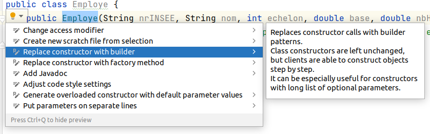
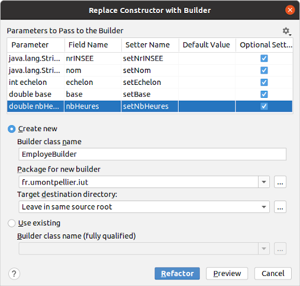

# 

# Développement Orienté Objets

### IUT Montpellier-Sète – Département Informatique

* [**Support de cours**](https://gitlabinfo.iutmontp.univ-montp2.fr/dev-objets/Ressources)
* **Enseignants:**
  [Malo Gasquet](mailto:malo.gasquet@umontpellier.fr),
  [Sophie Nabitz](mailto:sophie.nabitz@univ-avignon.fr),
  [Cyrille Nadal](mailto:cyrille.nadal@umontpellier.fr),
  [Victor Poupet](mailto:victor.poupet@umontpellier.fr),
  [Gilles Trombettoni](mailto:gilles.trombettoni@umontpellier.fr),
  [Petru Valicov](mailto:petru.valicov@umontpellier.fr)
* Le [forum Piazza](https://piazza.com/class/lrahb0patze3u4) de ce cours pour poser vos questions
* [Email](mailto:petru.valicov@umontpellier.fr) pour toute question concernant le cours.
* Le [sujet du TP](https://www.lirmm.fr/~pvalicov/Cours/dev-objets/TP5.pdf) en format .pdf téléchargeable et imprimable.

<!--Avant de démarrer le TP, vérifiez que vous n'avez pas atteint votre quota d'espace de stockage autorisé :

* placez-vous dans votre `$HOME` et utilisez les commandes suivantes :
    * `du -sh` pour voir combien d'espace vous avez déjà utilisé
    * `du -sh *` pour voir combien d'espace vous avez déjà utilisé pour chaque fichier (sans fichiers cachés)
    * `du -sch .[!.]* *` pour voir combien d'espace vous avez déjà utilisé pour chaque fichier, y compris les fichiers cachés
* Supprimez les fichiers inutiles.
* Pour éviter des problèmes durant vos TPs d'informatique, vous devriez toujours **garder 300-400 Mo d'espace libre**.
-->


### Consignes (importantes pour la notation)
- Vous respecterez toutes les [consignes](https://gitlabinfo.iutmontp.univ-montp2.fr/dev-objets/TP4#consignes) indiquées dans le TP précédent
- Vous respecterez les conventions de nommage *Java* (vues en [cours](https://www.lirmm.fr/~pvalicov/Cours/dev-objets/Generalites_x4.pdf)
  ou disponibles sur le site d'Oracle). Prêtez une attention particulière au respect des noms de classes, attributs et méthodes qui vous seront demandés.
- Dans ce TP, un principe important que vous devriez essayer de respecter dans votre code est le principe [DRY](https://fr.wikipedia.org/wiki/Ne_vous_r%C3%A9p%C3%A9tez_pas).
- Pour chaque question nécessitant une vérification automatique, vous écrirez des tests unitaires, pour valider votre solution.
- **Vous nommerez les classes telles que demandé dans le sujet et respecterez les signatures des méthodes qui vous sont demandées. Sinon, votre code ne pourra pas être testé...**


## TP 5 : Système de gestion des employés
#### _Thème : Héritage - réutiliser, mais sans en abuser_

Date limite de rendu de votre code sur le dépôt GitLab : **dimanche 3 mars à 23h00**

Vous êtes chargés de proposer une application de gestion des employés dans une entreprise.
L’objectif est de développer votre application de manière incrémentale, en ajoutant les fonctionnalités demandées au fur
et à mesure __sans modifier les fonctionnalités écrites précédemment__. Ce que l'on considère ici comme _modification,_
c'est effacer et/ou réécrire du code déjà écrit. _Ajouter_ du code sans modifier le code précédent est donc
une opération valide. On dira ici, que pour chaque modification de votre programme (effacement et réécriture) la
[dette](https://fr.wikipedia.org/wiki/Dette_technique) de votre logiciel augmente.
Afin de respecter les divers principes en programmation orientée objets (encapsulation, DRY, YAGNI etc.), vous essayerez d'éviter au maximum de _modifier_ le programme écrit précédemment pour ne pas trop augmenter cette dette...

Dans tout ce TP, tous les attributs devraient être `private` (en particulier il est **très déconseillé** d'utiliser la visibilité `protected` pour les attributs).

## Partie 1 - premiers pas dans l'héritage
L'intégralité du code de cette partie du TP doit résider dans le paquetage `fr.umontpellier.iut.partie1`.

Vous êtes chargés de développer un système de gestion d'employés. Chaque employé est représenté par les données suivantes : numéro de sécurité sociale, nom, échelon (entier naturel). Pour pouvoir calculer le salaire brut et le salaire net d'un employé, deux attributs supplémentaires de type `double` sont nécessaires : `base` et `nbHeures`. Le constructeur de la classe `Employe` vous est donné, merci de garder **les paramètres dans cet ordre** :

   ```java
   public Employe(String nrINSEE, String nom, int echelon, double base, double nbHeures)
   ```
Vous avez également un _setter_ sur les attributs `base` et `echelon` de la classe `Employe`.

### Exercice 1
1. Le salaire brut de l’employé se calcule de la manière suivante : `base * nbHeures`. Le salaire net représentera toujours 80% du salaire brut. Ajoutez le code nécessaire (attributs et méthodes) pour intégrer ces fonctionnalités et proposez des méthodes respectives `getSalaireBrut()` et `getSalaireNet()`.

1. Redéfinissez la méthode `String toString()` dans la classe `Employe` pour afficher les informations concernant un employé (y compris ses salaires brut et net). Observez le terme _redéfinir_ : il s'agit de _modifier_ le comportement par défaut de cette méthode `toString()` prévu dans la classe `Object` -- la classe mère de toutes les classes en Java. Depuis votre IDE, vous pouvez regarder le code source de `String toString()` de la classe `Object` pour voir comment elle est implémentée (si vous ne trouvez pas, demandez à votre enseignant). 

1. Si jamais votre client vous demande de changer (modifier donc) la formule de calcul du salaire brut et de la fixer à `base * nbHeures * 1.05`, combien de changements devriez-vous effectuer au minimum pour que votre programme continue de fonctionner correctement ? Attention, comme convenu précédemment, dans ce qui suit, le salaire brut d'un employé restera toujours le même, à savoir `base * nbHeures`. Donc ne changez pas votre code pour la question 1.

1. Vérifiez votre solution dans le programme principal -- la classe `GestionEmployes`. Vous y instancierez plusieurs
   employés et afficherez les informations les concernant. N'oubliez pas les tests unitaires pour les questions précédentes !


### Exercice 2

1. Avec le développement de l'entreprise, une séparation des traitements pour les différents types d'employés devient nécessaire. Il faut spécifier les cas des _Commerciaux_, _Fabricants_ et les autres employés qu’on appellera
   _Techniciens_.
   * La classe `Commercial` a comme attributs `chiffreAffaires` et `tauxCommission`  (tous les deux de type `double`).
   * La classe `Fabricant` a comme attributs `nbUnitesProduites` et `tauxCommissionUnite` (type `int`et `double` respectivement).
   * La classe `Technicien` n'a pour l'instant aucun nouveau attribut, ni aucune nouvelle méthode.

   Implémentez les classes correspondantes en les faisant hériter de la classe `Employe`.

   Voici la signature des constructeurs de ces classes :
   ```java
   public Commercial(String nrINSEE, String nom, int echelon, double base, double nbHeures, double chiffreAffaires, double tauxCommission)
   public Fabricant(String nrINSEE, String nom, int echelon, double base, double nbHeures, int nbUnitesProduites, double tauxCommissionUnite)
   public Technicien(String nrINSEE, String nom, int echelon, double base, double nbHeures)
   ```

2. Un commercial peut négocier des transactions avec la méthode `negocierTransaction(double sommeGagnée)`, elle incrémentera son chiffre d'affaires. Un fabricant fabrique des produits avec la méthode `void fabriquerProduits(int nbProduits)` ce qui incrémente de `nbProduits` son nombre d'unités produites. Un technicien effectue les autres tâches importantes de l’entreprise à travers la méthode `void effectuerTacheTechnique()`, ce qui incrémente de 1 son échelon actuel. Toutes ces méthodes sont de type `void` et vous pouvez faire en sorte d'afficher un message approprié pour illustrer leur bon fonctionnement. Par exemple, la méthode `void negocierTransaction(double sommeGagnée)` pourra en plus afficher le texte ”_Je négocie une transaction_”.

3. Vérifiez votre programme dans la classe principale, en instanciant un objet pour chaque nouveau type d'employé et en appelant sa fonction spécifique.

4. On souhaite varier le calcul des salaires bruts des différents types d’employés :
   * Le salaire brut d’un technicien est composé de son salaire brut en tant qu’employé + une majoration en fonction de son échelon. De point de vue mathématique, le résultat du retour de la fonction de calcul du salaire brut devra être égal à `base ∗ nbHeures + echelon ∗ 100`.
   * Le salaire brut d’un commercial dépend du chiffre d’affaires qu’il réalise. Ainsi, le salaire brut se calcule suivant la formule `base + chiffreAffaires ∗ tauxCommission`.
   * Le salaire brut d’un fabricant est calculé de la même manière que le salaire brut d’un employé en ajoutant une rémunération supplémentaire en fonction du rendement. Ainsi, le résultat de ce calcul devrait correspondre à `base ∗ nbHeures + nbUnitesProduites ∗ tauxCommissionUnite`.
   * **Important :** la modalité de calcul du salaire net demeure inchangée pour tous les employés (à savoir 80% du salaire brut).

   _Redéfinissez_ la méthode `getSalaireBrut()` dans chaque classe d'employé spécifique pour prendre en compte ces nouvelles formules. Vous ajouterez le code qui vous paraît nécessaire à la classe `Employe` mais sans modifier le code précédemment écrit.

5. Déclarez un objet de type `Employe` et instanciez-le en tant que `Fabricant`. Observez le résultat de l'appel des méthodes `getSalaireBrut()` et `getSalaireNet()`. Est-ce que la méthode `fabriquerProduits(int nbProduits)` est accessible sur cet objet ? Expliquez en comparant avec le scénario où l'objet serait déclaré en tant que `Fabricant`.

6. Si jamais le patron devient plus généreux et décide d’ajouter une somme fixe de 100€ au salaire brut de tous ses employés, combien de modifications devez-vous apporter à votre code pour que cela fonctionne ? Attention, c'était une blague, le patron ne sera pas généreux, donc ne faites pas cette modification !

### Exercice 3

1. Maintenant, votre client se rend compte qu’un `Commercial` ne peut pas être un simple commercial (donc ne peut pas être instancié en tant que tel), mais doit être distingué en tant que `Vendeur` ou `Representant`. Un vendeur peut vendre des produits (méthode `void vendreProduit()`) et un représentant peut représenter l'entreprise auprès des différents clients (méthode `void representerEntreprise()`). Ajoutez les deux classes correspondantes en faisant un héritage de `Commercial`.

   Voici la signature des constructeurs de ces classes :
    ```java
    public Vendeur(String nrINSEE, String nom, int echelon, double base, double nbHeures, double chiffreAffaires, double tauxCommission)
    public Representant(String nrINSEE, String nom, int echelon, double base, double nbHeures, double chiffreAffaires, double tauxCommission)
    ```

   Pour rendre la classe `Commercial` non-instanciable il faut modifier sa déclaration en ajoutant le mot-clé `abstract` : `public abstract class`. Observez les changements à faire à l'utilisation des objets `Commercial`.

2. La méthode `void representerEntreprise()` de la classe `Representant` incrémente le nombre de représentations effectuées par ce salarié (un attribut de cette classe donc).

3. Pour terminer, faites en sorte que la méthode de calcul du salaire brut d'un vendeur soit _toujours_ la même que la méthode de calcul du salaire brut d'un commercial, mais que la formule de calcul du salaire brut des représentants, soit _toujours_ la même que celle utilisée pour le salaire brut des _techniciens_ + le nombre de représentations * 123. Ajoutez cette fonctionnalité dans votre application.

   **Attention** à ne pas dupliquer du code (principe [DRY](https://fr.wikipedia.org/wiki/Ne_vous_r%C3%A9p%C3%A9tez_pas))
   et à ne pas modifier le code précédemment écrit ! Sinon la [dette](https://fr.wikipedia.org/wiki/Dette_technique)
   de votre logiciel va augmenter. :smirk:

4. Quels sont les avantages et inconvénients de votre solution à la question précédente ?

5. Dessinez le diagramme de classes afin de mieux comprendre votre solution. Vous déposerez le diagramme sous forme d'image (.png ou .jpg) à la racine de votre dépôt Git.

## Partie 2 - builders

L'intégralité du code de cet exercice devra résider dans le paquetage `fr.umontpellier.iut.partie2`. Pour cela, vous allez copier/coller **l'intégralité** du code du paquetage `fr.umontpellier.iut.partie1` dans la partie 2.

Rappelons qu'à la [question 5, Exercice 3 du TP3](https://gitlabinfo.iutmontp.univ-montp2.fr/dev-objets/tp3#exercice-3-bonus), vous avez découvert la notion de _builder_. En effet, les constructeurs des différents types d'employés ont beaucoup de paramètres et souvent à la création des objets, plusieurs attributs des classes pourraient être initialisés à des valeurs par défaut. Typiquement, c'est le cas dans les tests unitaires : lorsque des objets `Employe` sont instanciés dans les tests pour vérifier le bon fonctionnement des fonctions de calcul de salaire brut ou net, le nom ou le numéro INSEE ne sont pas nécessaires, donc il serait intéressant de pouvoir les "omettre" et les laisser initialisés à des valeurs par défaut.

### Exercice 1

1. Commençons par la classe `Employe` et proposons un _builder_ pour une construction plus souple. Vous pouvez générer le _builder_ de manière automatique avec l'outil de refactoring d'IntelliJ IDEA :
   * clic droit sur le nom du constructeur de votre classe &rightarrow; _Show Context Actions_ &rightarrow;
     _Replace Constructor with Builder_

     
     <!--pour utilisation avec Pandoc {width=60%} -->
   * Dans la fenêtre qui s'affiche vous cocherez tous les paramètres et cliquerez sur le bouton _Refactor_

     
     <!--pour utilisation avec Pandoc {width=50%} -->
   
   * On peut continuer à refactoriser et rendre le Builder comme une classe interne statique de la classe `Employe` en faisant un glisser/déposer (drag & drop) de `EmployerBuilder` dans `Employe` dans la fenêtre de l'IDE.

   C'est sûrement possible de générer le builder dans d'autres IDE, on vous laisse vous documenter.

2. Créez plusieurs objets `Employe` dans la classe `GestionEmployes` en n'initialisant que certains attributs de la classe (au choix) grâce au builders. Comparez avec la construction en utilisant directement le constructeur explicite de `Employe`. Constatez : est-ce que la construction avec builder vous paraît plus souple ou non ?

3. Implémentez maintenant, les _builders_ pour les classes `Technicien`, `Fabricant`, `Representant` et `Vendeur` en faisant la même chose. Et vérifiez la construction dans la classe `GestionEmployes`.

   **Remarque :** Notez la duplication de code entre le builder de la classe `Employe` et les builders de ses sous-classes (non-respect du principe [DRY](https://fr.wikipedia.org/wiki/Ne_vous_r%C3%A9p%C3%A9tez_pas)).

### Exercice 2 - et la duplication de code alors ?

1. Essayons maintenant de corriger le tir et éviter au maximum la duplication de code dans les différents builders.
   Commençons par le builder de `Fabricant`. Faites un héritage entre `EmployeBuilder` et `FabricantBuilder` et effacez les méthodes redondantes de `FabricantBuilder`, afin d'éviter la duplication de code. Est-ce que votre programme fonctionne toujours comme avant ? Argumentez.

    En effet, l'héritage entre les _builders_ semble naturel, mais il n'est pas si facile à mettre en place. Donc pour le moment, vous pouvez tolérer le défaut de duplication de code et laisser les classes _builders_ telles quelles sans faire d'héritage entre elle.

    Dans quelques semaines, après avoir suffisamment avancé dans le cours, nous y reviendront pour améliorer. Pour les curieux, il y a des explications sur le net, mais cela implique d'avoir des connaissances sur les [types génériques](https://fr.wikibooks.org/wiki/Programmation_Java/Types_g%C3%A9n%C3%A9riques) que nous n'avons pas encore vus dans le cours : https://stackoverflow.com/questions/21086417/builder-pattern-and-inheritance

    Une explication approfondie et une solution sont également données dans _Effective Java_ de J. Blosch, (3ème édition).

2. **Gros Bonus :** Si vous êtes vraiment en avance et voulez tenter de trouver une solution qui évite la duplication de code entre les différentes classes _builders_, alors vous pouvez travailler dans un nouveau paquetage. Pour avoir une vraie solution flexible, il faudrait que :
   * Un `Employe` soit instantiable en tant que `Employe`, mais aussi en tant que `Fabricant`, `Representant`, etc.
   * Un `Commercial` soit instantiable en tant que `Representant` et `Vendeur`.
   * Un `Representant` puisse être instantiable en tant que `Representant`, un `Technicien` en tant que `Technicien`, etc.
   * Les duplications de code entre les _setters_ des différents builders soient supprimées.
   * Il n'y ait aucun _cast_ dans votre code (conversion explicite d'un type à un autre, à la main).

   Pensez à consulter les références citées ci-dessus pour vous faire guider.
