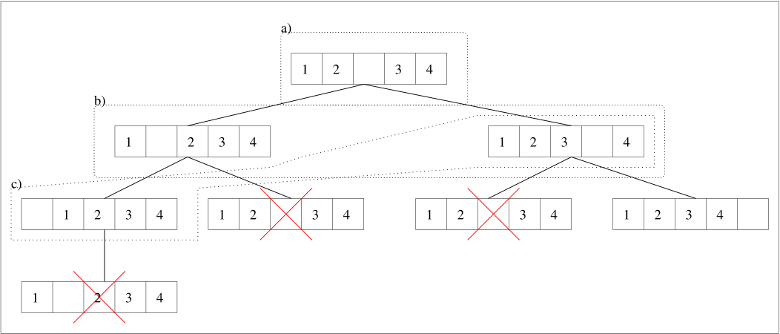

# 

# Développement Orienté Objets

### IUT Montpellier-Sète – Département Informatique

* [**Support de cours**](https://gitlabinfo.iutmontp.univ-montp2.fr/dev-objets/Ressources)
* **Enseignants:**
  [Malo Gasquet](mailto:malo.gasquet@umontpellier.fr),
  [Sophie Nabitz](mailto:sophie.nabitz@univ-avignon.fr),
  [Cyrille Nadal](mailto:cyrille.nadal@umontpellier.fr),
  [Victor Poupet](mailto:victor.poupet@umontpellier.fr),
  [Gilles Trombettoni](mailto:gilles.trombettoni@umontpellier.fr),
  [Petru Valicov](mailto:petru.valicov@umontpellier.fr)
* Le [forum Piazza](https://piazza.com/class/lrahb0patze3u4) de ce cours pour poser vos questions
* [Email](mailto:petru.valicov@umontpellier.fr) pour toute question concernant le cours.
* Le [sujet du TP](https://www.lirmm.fr/~pvalicov/Cours/dev-objets/TP6.pdf) en format .pdf téléchargeable et imprimable.

<!--Avant de démarrer le TP, vérifiez que vous n'avez pas atteint votre quota d'espace de stockage autorisé :

* placez-vous dans votre `$HOME` et utilisez les commandes suivantes :
    * `du -sh` pour voir combien d'espace vous avez déjà utilisé
    * `du -sh *` pour voir combien d'espace vous avez déjà utilisé pour chaque fichier (sans fichiers cachés)
    * `du -sch .[!.]* *` pour voir combien d'espace vous avez déjà utilisé pour chaque fichier, y compris les fichiers cachés
* Supprimez les fichiers inutiles.
* Pour éviter des problèmes durant vos TPs d'informatique, vous devriez toujours **garder 300-400 Mo d'espace libre**.
-->


### Consignes
- Sauf indication contraire, **tous** les attributs que vous allez déclarer doivent être privés (`private`).
- La plupart des méthodes devraient être déclarées publiques (`public`). Vous pouvez tout de même déclarer et utiliser des méthodes `private` du moment qu'elles vous sont utiles et que votre programme fonctionne correctement.
- Essayez de respecter les conventions de nommage *Java* (vues en [cours](https://www.lirmm.fr/~pvalicov/Cours/dev-objets/Generalites_x4.pdf) ou disponibles sur le site d'Oracle).
- **Sauf indication contraire, vous ne devrez pas modifier la signature des méthodes et des attributs des classes qui vous sont proposées.**
- Vous essaierez de respecter au maximum les différents principes vus en cours :
  * principes [DRY](https://fr.wikipedia.org/wiki/Ne_vous_r%C3%A9p%C3%A9tez_pas), KISS et [YAGNI](https://fr.wikipedia.org/wiki/YAGNI)
  * encapsulation de vos classes
  * contrat des classes parentes par héritage
- Des commentaires sont donnés dans le code qui vous est fourni afin de vous aider à comprendre ce que vous êtes censés programmer.


## TP6
#### _Thème : Héritage, Interfaces_

Date limite de rendu de votre code sur votre dépôt GitLab :
* **Partie 1** : **dimanche 10 mars à 23h00**
* **Partie 2** : **dimanche 17 mars à 23h00**

L'objectif de ce TP est d'écrire un algorithme qui résout par exploration totale n'importe quel "puzzle". Avant de commencer le travail, nous allons illustrer cet algorithme sur un puzzle très simple : un [taquin](https://fr.wikipedia.org/wiki/Taquin) en une dimension.
Puis, vous implémenterez dans la [Partie 1](https://gitlabinfo.iutmontp.univ-montp2.fr/dev-objets/TP6#partie-1) cet algorithme sur un taquin **en deux dimensions**.
Enfin, vous généraliserez cet algorithme à n'importe quel puzzle dans la [Partie 2](https://gitlabinfo.iutmontp.univ-montp2.fr/dev-objets/TP6#partie-2).

Prenons l'exemple d'un taquin en une dimension à 5 cases. La position initiale (notée `1 2 * 3 4`) du taquin est dessinée en haut de la Figure 1 :



**Figure 1 :** Arbre d'exploration des solutions d'une configuration de taquin à une dimension

Le trou se trouve au milieu, avec les palets 1 et 2 à gauche, et 3 et 4 à droite. On considère que la position
gagnante est `1 2 3 4 *`.
Nous allons décrire informellement l'algorithme pour résoudre le taquin. Cet algorithme utilise deux variables :
* __frontiere__ : qui va contenir à chaque instant un ensemble de configurations de taquin différentes qu'il reste à
  examiner
* __dejaVus__ : qui va contenir à chaque instant l'ensemble des configurations déjà examinées.

On initialise `frontiere` et `dejaVus` avec la configuration initiale, et on maintiendra l'invariant que `frontiere`
est un sous-ensemble de `dejaVus`. À chaque étape, on extrait une configuration de la frontière, on en génère toutes
les configurations "filles" c'est-à-dire les configurations atteignables en effectuant _un seul mouvement valide_, puis
on ajoute à  `frontiere` et à `dejaVus`  toutes les configurations filles qui n'ont pas été déjà vues. Les ensembles de
configurations **a)**, **b)** et **c)**, délimités en pointillés, indiquent l'évolution de la frontière lors des 3 premières
étapes (en supposant que lorsque la frontière était égale à **b)**, c'est la configuration `1 * 2 3 4` qui a été extraite).
Remarquez que les configurations barrées ne sont pas ajoutées à la `frontiere` (ni à `dejaVus`) puisqu'elles sont déjà
présentes dans `dejaVus` au moment où l'on essaye de les ajouter. L'algorithme se termine lorsqu'il atteint une
configuration gagnante, ou lorsque la frontière devient vide. Ainsi, on obtient une structure arborescente (ou arbre
d'exploration) représentant l'ensemble de mouvements valides obtenus à partir de la racine (configuration initiale).

**Remarque** : certaines configurations du taquin ne sont pas résolubles. En une dimension il est facile de voir que les
cases ne peuvent pas se croiser (donc par exemple la configuration `2 1 * 3 4` ne peut pas être résolue) et en deux
dimensions, on peut montrer que la moitié des configurations initiales possibles n'admettent pas de solution (cf.
[page _Wikipédia_](https://fr.wikipedia.org/wiki/Taquin#Configurations_solubles_et_insolubles) pour une caractérisation).

L'algorithme expliqué ci-dessus permet de résoudre le taquin, à savoir obtenir la configuration finale gagnante si elle
existe. Dans ce qui suit, on vous demandera également de stocker la _trace_ de la solution, qui indique les configurations
obtenues à chaque étape intermédiaire pour arriver à la solution finale. Avoir la trace est intéressant pour
un utilisateur, afin de voir la stratégie à adopter pour résoudre le puzzle à partir de la configuration initiale. C'est aussi pratique pour vérifier si votre programme fonctionne correctement... La trace de la solution va correspondre à une liste chaînée de configurations construite de la façon suivante : lorsqu'une configuration $`c_{2}`$ est générée à partir d'une configuration $`c_{1}`$, on mémorisera que
le "_père_" de $`c_{2}`$ est $`c_{1}`$. Un maillon de cette liste chaînée est donc un couple (_configuration taquin, couple parent_).

Dans tout le TP, nous vous invitons à vérifier au fur et à mesure que votre code est correct.
Pour cela, utilisez les tests fournis (pour certaines questions seulement), et pensez à en écrire d'autres. Également pensez à compléter la méthode `main(String args[])` des classes principales (`fr.umontpellier.iut.partie1.AppTaquin` et `fr.umontpellier.iut.partie2.AppJeuxPuzzle`).


### Partie 1 - Le jeu du Taquin
#### Exercice 1

La classe `Taquin` vous est donnée dans le package `fr.umontpellier.iut.partie1`. L'attribut `tableau` représente le plateau du taquin en deux dimensions. On supposera que le trou du plateau est représenté par le chiffre `0` et que la première dimension (resp. deuxième dimension) du tableau représente la ligne (resp. colonne). Attention, dans tout le sujet les exemples sont donnés sur des taquins carrés, mais il faudra bien être capable de gérer dans toutes vos méthodes des taquins rectangulaires. Dans l'exemple ci-dessous, la case [1][3] contient le chiffre 2 et la case [2][2] contient le chiffre 8 :

    ```
    +---------------+
    | 1   4   3  12 |
    |11   5  13   2 |
    | 7  14   8   9 |
    |10   6   0  15 |
    +---------------+
    ```

Complétez la classe `Taquin` comme suit :

1. Redéfinissez la méthode `toString()` dans la classe `Taquin` afin d'afficher le contenu de son plateau.
   Pour un taquin `n X m` l'orientation imposée est la suivante : la ligne du haut contient, de gauche à droite, les cases [0][0], [0][1], ... , [0][m-1], et la case en bas à droite est donc [n-1][m-1].

2. Complétez la méthode `public boolean estGagnant()` afin qu'elle retourne _vrai_ si le plateau est dans une
   configuration gagnante et _faux_ sinon. Voici les configurations gagnantes pour des taquins $`3 \times 3`$ et $`4 \times 4`$:

    ```
    +-----+    +---------------+
    |1 2 3|    | 1   2   3   4 |
    |4 5 6|    | 5   6   7   8 |
    |7 8 0|    | 9  10  11  12 |
    +-----+    |13  14  15   0 |
               +---------------+
    ```

3. Redéfinissez la méthode `equals(Object o)` dans la classe `Taquin` afin qu'elle permette de comparer le `Taquin` courant avec un autre passé en paramètre.

   **Astuce :** nous vous conseillons d'utiliser votre IDE pour redéfinir `equals(Object o)` et de prendre le temps de comprendre le code qu'il vous générera. **Attention**, il y a des fortes chances que vous soyez amené à ajuster cette redéfinition, en fonction de la logique du code de votre classe `Taquin` (faites des tests unitaires pour vérifier !). Prêtez également attention à la redéfinition de la méthode `public int hashCode()` de `Object` qui va être faite. Discutez-en avec votre enseignant (voir aussi le [cours](https://www.lirmm.fr/~pvalicov/Cours/dev-objets/Heritage_Polymorphisme_x4.pdf)).

4. Écrivez le corps de la méthode  `public int[] trouverTrou()` afin qu'elle retourne un tableau `[i,j]` si `tableau[i][j]==0`. Cette méthode a pour prérequis que le taquin contient bien un seul 0.

5. Écrivez le corps de la méthode `public ArrayList<Taquin> genererFils()`. Cette dernière retourne la liste des objets `Taquin` que l'on
   peut obtenir en faisant un mouvement valide. Attention, cette méthode ne doit pas modifier `this`, et les taquins retournés dans la liste doivent être "indépendants" de `this` (c'est-à-dire avoir leur propre tableau d'entiers comme plateau). Pour `genererFils()`, on peut suivre la stratégie suivante :
    * commencer par trouver les coordonnées du trou ;
    * si le trou n'est pas collé à gauche, alors on peut générer le fils dans lequel le trou est déplacé à gauche ;
    * si le trou n'est pas collé à droite, alors... etc.


#### Exercice 2

Rappelez-vous que nous aurons besoin de "couples chaînés" pour pouvoir retrouver la suite des coups effectués lorsque l'algorithme trouve une position gagnante. C'est pour cela que la classe `Couple` vous est donnée. Complétez cette classe
de la façon suivante :

1. Écrivez le corps de la méthode `public ArrayList<Taquin> getListeDeMouvements()` ayant les spécifications suivantes :

    * __hypothèse__ : le couple courant (`this`) représente une solution ayant été atteinte depuis la racine de l'arbre
      d'exploration (on a donc un chaînage du type
      `null` &leftarrow; _couple_racine_ &leftarrow; _couple_1_ &leftarrow; ... &leftarrow; _couple_k_ &leftarrow; _couple_courant_)
    * __effet__ : retourne une  `ArrayList<Taquin>` de la forme `[couple_racine.taquin, couple_1.taquin,..,couple_k.taquin, couple_courant.taquin]`,
      qui correspond donc à la description de la solution trouvée

2. Complétez la méthode `public void mettreAJour(ArrayList<Couple> frontiere, ArrayList<Taquin> dejaVus)` pour qu'elle respecte la spécification ci-dessous. Avant de lire cette spécification, considérons l'exemple la Figure 1 dans lequel
    * `this` représente le couple dont le taquin est celui de gauche dans la frontière **b)** (et son prédécesseur pointe sur la racine)
    * `frontiere` est l'ensemble d'objets `Couple` dont les taquins sont ceux de **b)**
    * les taquins fils du taquin contenu dans `this` sont `* 1 2 3 4` et `1 2 * 3 4`
    * `dejaVus` est l'ensemble des 3 taquins de **a) U b)**

   Dans cet exemple, `mettreAJour(frontiere,dejaVus)` doit ajouter le taquin `t = * 1 2 3 4` à `dejaVus`
   ainsi que le couple `(t,this)` à `frontiere`, et ne rien faire pour le taquin `1 2 * 3 4` puisqu'il est déjà dans `dejaVus`.

   La spécification est donc la suivante : `mettreAJour(frontiere,dejaVus)` ajoute à `frontiere` tous les couples `(t,this)` avec `t` appartenant aux fils du taquin de `this`, et tels que `t` n'est pas dans `dejaVus`. Dans ce cas, cette méthode met également à jour `dejaVus`, en y ajoutant `t`.

   **Remarque :** Ici nous vous recommandons d'utiliser entre autres la méthode `boolean contains(o)` définie dans
   `ArrayList` qui renvoie vrai si `o` appartient à l'objet `ArrayList`. Expliquez pourquoi ce test d'appartenance
   fonctionnera correctement si on l'invoque sur un objet `ArrayList<Taquin>`.

#### Exercice 3

La classe `Contexte` va encapsuler l'algorithme général de résolution du jeu. L'attribut `Taquin taquinInitial` servira à stocker le taquin initial donné à l'objet `Contexte`, et l'attribut `solution` de type `ArrayList<Taquin>` servira à stocker la _trace_ des mouvements valides que l'algorithme a effectué depuis la position donnée par l'utilisateur afin d'obtenir une position gagnante (la liste sera vide si le taquin n'a pas de solution).


1. Complétez la méthode `public void resoudre()` afin qu'elle affecte à l'attribut `solution` une `ArrayList<Taquin>` vide si `taquin` n'est pas faisable ou la liste des positions successives qui mènent à un état gagnant sinon.

2. Dans votre méthode `resoudre()`, il y a plusieurs façons de gérer votre frontière :
    * comme une _pile_ : le taquin extrait à chaque nouvelle étape est le dernier taquin à avoir été ajouté. Dans ce cas
      l'exploration de l'arbre se fera en profondeur (c'est-à-dire que l'on termine complètement une branche avant de
      passer à la suivante).
    * comme une _file_ : le taquin extrait à chaque nouvelle étape est le premier à avoir été ajouté. Dans ce cas
      l'exploration de l'arbre se fera en largeur (tous les taquins à distance 1 de la racine, puis tous les taquins
      à distance 2, etc.).

   Regardez dans votre code de la question précédente si votre frontière est gérée en _pile_ ou en _file_ et réfléchissez
   à la politique de gestion (_pile_ vs _file_) que vous préférez.

3. Redéfinissez la méthode `toString()` afin d'afficher la solution.

4. Testez d'abord avec des taquins que l'on peut résoudre. Pour cela, créez un taquin à distance 1 de la position gagnante (c'est-à-dire nécessitant un mouvement pour le résoudre), puis à distance 2, puis à distance _k_ > 2.
   Ensuite, testez avec un taquin quelconque. Si votre algorithme s'exécute pendant plusieurs minutes, comment essayer de savoir s'il est dans une boucle infinie ou si "quelque chose" progresse ? Quelle(s) donnée(s) pourriez-vous afficher (même si cela ralentit énormément l'algorithme) pour répondre à cette question ?

### Partie 2 - création d'un framework de résolution de puzzle

Maintenant, nous allons généraliser cette stratégie à la résolution d'autres jeux de type "puzzle". Afin de garder un historique du programme écrit précédemment, nous allons travailler dans un **package différent**.

1. Copiez/collez les classes `Taquin`, `Couple` et `Contexte` dans le package `fr.umontpellier.iut.partie2`. Pour faire
   cela correctement, la manière la plus simple est de sélectionner **en même temps** les 3 classes dans l'IDE
   &rightarrow; _Copier_  &rightarrow; _Coller_ dans le package. Quelle que soit la manière dont vous allez procéder, l'IDE
   vous signalera des duplications de code (logique, car c'est ce que vous avez fait), mais _dans ce cas_ (et pour
   _ce genre de duplications demandées_) vous
   allez ignorer ces avertissements, car c'est un moyen simple de garder une copie de ce que vous avez fait dans les
   exercices précédents. Pour ce faire, vous pouvez ajouter l'annotation `@SuppressWarnings("Duplicates")` à la ligne juste avant la déclaration de la classe nouvellement copiée.

2. Observez que les fonctions "essentielles" de la classe `Taquin` sont suffisamment générales pour être appliquées sur d'autres jeux de même nature. Ajoutez donc dans l'interface `JeuPuzzle` les méthodes en question de façon à ce que l'interface `JeuPuzzle` généralise `Taquin`. Remarquez la situation délicate de la méthode `genererFils()` : dans la classe `Taquin` elle retourne un objet de type `ArrayList<Taquin>`. Par conséquent, dans l'interface `JeuPuzzle`, on devrait adapter la signature de cette fonction... Mais comment le faire ?
   * On pourrait penser qu'il faut utiliser `ArrayList<JeuPuzzle>` (après tout `JeuPuzzle` est la super-classe de `Taquin`). Sauf que la phase compilation va échouer. Voyez-vous pourquoi ? Discutez avec votre enseignant.
   * Pour résoudre le problème ci-dessus, il faut utiliser les __types génériques__, que l'on verra bientôt [en cours](https://www.lirmm.fr/~pvalicov/Cours/dev-objets/Genericite_Structures_de_Donnees_x4.pdf).
     * Dans un premier temps, le plus simple est d'utiliser les __types génériques inconnus__ (wildcards), avec l'instruction `ArrayList<? extends JeuPuzzle>`. Cette syntaxe signifie que l'on peut substituer le type inconnu `?` par n'importe quelle classe qui hérite de `JeuPuzzle` (et donc, en particulier, `Taquin`). Testez cette solution dans votre code et vérifiez si cela fonctionne. Cette solution, bien qu'elle semble marcher, n'est pas parfaite. Pourquoi ? Discutez avec votre enseignant.
     * Voici donc la solution la plus propre pour garantir que les objets retournés par `genererFils()` soient bien des `Taquin` dans la classe `Taquin`, des `Hanoi` dans la classe `Hanoi`, etc. :
       ```java
          public interface JeuPuzzle<T extends JeuPuzzle<T>> {
             boolean estGagnant();
             ArrayList<T> genererFils();
          }
       ```
       Dans cette solution, `T` est un type générique **fixé** qui est une sous-classe de `JeuPuzzle`. Ainsi, dans la classe `Taquin`, `T` sera **nécessairement** `Taquin`, dans la classe `Hanoi`, `T` sera **nécessairement** `Hanoi`, etc.
      

3. Faites en sorte que `Taquin` soit une implémentation de l'interface  `JeuPuzzle`  et modifiez votre programme de manière correspondante. Voici comment votre framework devra pouvoir être utilisé dans la classe cliente :

   ```java
      JeuPuzzle jeuPuzzle = new Taquin(tableau);
      Contexte contexte = new Contexte(jeuPuzzle);
      contexte.resoudre();
      System.out.println(contexte.getSolution());
   ```

Nous allons maintenant utiliser cette interface pour implémenter un autre jeu : [les tours de Hanoï](https://fr.wikipedia.org/wiki/Tours_de_Hano%C3%AF).
Dans ce jeu, on considère 3 poteaux (dénommés "1" (à gauche), "2" (au milieu), et "3" (à droite)), ainsi que $`n`$ disques de diamètres deux à deux distincts. Les disques sont troués en leur centre, de telle sorte que l'on puisse les enfiler
sur les poteaux. Dans la situation initiale, les $`n`$ disques sont sur le poteau gauche et rangés "en pyramide" :
c'est-à-dire de telle sorte que les plus petits disques sont au-dessus. Le but du jeu est de déplacer cette pyramide sur
le poteau de droite, en sachant qu'un coup légal consiste à
* choisir un poteau de départ et prendre le disque du dessus
* choisir un poteau d'arrivée et déposer le disque au sommet
* s'assurer que sur chaque poteau les disques restent rangés en pyramide (autrement dit, un disque ne peut être placé que sur un disque de plus grand diamètre).

Par exemple, pour $`n=3`$ la succession de coups _1 &rightarrow; 2_ (signifiant prendre le disque au sommet du poteau 1 et
le placer au sommet du poteau 2) _1 &rightarrow; 3_, _2 &rightarrow; 3_ est légale, alors que la succession de coups
_1 &rightarrow; 2_, _1 &rightarrow; 2_ ne l'est pas.

4. Complétez la classe `Hanoi` qui modélise ce jeu et qui doit implémenter l'interface `JeuPuzzle`.
 
- Pour modéliser l'état du jeu, on suggère d'utiliser trois `ArrayList<Integer>` contenant chacune les numéros des disques présents sur le poteau correspondant (disques numérotés de  `1`, le plus petit, à  `n`). Ajoutez également un attribut `private int taille` pour indiquer le nombre de disques. Cet attribut est certes  redondant, puisque l'on pourrait retrouver la taille en calculant l'entier maximum contenu dans les trois `ArrayList<Integer>`, mais il évitera justement de refaire ce calcul à chaque fois.
- Pour la génération de fils, on considère qu'un fils est une configuration que l'on peut atteindre avec un seul mouvement de disque légal.
- Pour la vérification qu'une configuration est gagnante, on pourra supposer que le jeu est dans une configuration légale (c'est à dire sans grands diques empilés sur des petits). En effet, on applique le principe de **responsabilité unique** : c'est à `genererFils` de s'assurer que les configurations générées sont légales, et il est donc inutile de le vérifier ailleurs.

5. Modifiez la classe principale (`AppJeuxPuzzle`) pour maintenant tester la résolution de Hanoï (commencez par 3 disques sur le poteau gauche).
   On constate (avec joie !) qu'il n'y a pas à modifier l'algorithme de résolution puisqu'il fonctionne de façon "transparente"
   pour tout `JeuPuzzle`.

6. Dessinez le diagramme de classes de cette partie du sujet. Vous y indiquerez toutes les classes du package `fr.umontpellier.iut.partie2`, sauf la classe `Sudoku` (voir questions suivantes).

**Remarque** : cette façon de programmer, en proposant une interface d'algorithme générale qui sera ensuite implémentée
différemment, et dont les implémentations pourront être interchangées "à la volée" par l'utilisateur dans la classe cliente (ici `AppJeuxPuzzle`), fait référence au modèle de conception communément appelé
[_Stratégie_](https://en.wikipedia.org/wiki/Strategy_pattern).

7. Vous allez maintenant implémenter le jeu de [Sudoku](https://fr.wikipedia.org/wiki/Sudoku), où le programme prend en entrée une grille carrée $`n_{2} \times n_{2}`$ (par exemple $`9 \times 9`$) contenant des chiffres déjà placés dans certaines cases.
   Si une solution existe, alors le programme devra remplir les cases vides avec les chiffres correspondants de façon à ce que :
    * la grille devienne un [carré latin](https://fr.wikipedia.org/wiki/Carr%C3%A9_latin);
    * les sous-blocs de la grille de taille $`n = \sqrt{n_{2}}`$ contiennent une permutation des $`n`$ chiffres.

   Si la grille n'admet pas de solution, alors comme dans le cas du jeu de Taquin, il faudra que l'attribut `solution` de l'objet `Contexte` soit une `ArrayList` vide.

   Ci-dessous, un exemple d'une grille de Sudoku donnée en entrée et une solution obtenue en sortie :

   ```
   +-----------------------------+     +-----------------------------+
   | 8     6 | 2     9 | 1  4    |     | 8  3  6 | 2  5  9 | 1  4  7 |
   | 9  2    |    7    | 8  5  6 |     | 9  2  1 | 3  7  4 | 8  5  6 |
   |    4    | 8       |    2    |     | 7  4  5 | 8  6  1 | 3  2  9 |
   |-----------------------------|     |-----------------------------|
   | 3  6  2 | 9  8  5 | 7  1    |     | 3  6  2 | 9  8  5 | 7  1  4 |
   | 1     7 |       3 |    8  2 |     | 1  5  7 | 6  4  3 | 9  8  2 |
   |       9 | 1  2    | 6  3    |     | 4  8  9 | 1  2  7 | 6  3  5 |
   |-----------------------------|     |-----------------------------|
   |    7  4 | 5     8 | 2  9  3 |     | 6  7  4 | 5  1  8 | 2  9  3 |
   | 5  9  8 | 7  3  2 |    6  1 |     | 5  9  8 | 7  3  2 | 4  6  1 |
   | 2  1  3 | 4  9    |    7    |     | 2  1  3 | 4  9  6 | 5  7  8 |
   +-----------------------------+     +-----------------------------+
    ```
   Complétez la classe `fr.umontpellier.iut.partie2.Sudoku`, qui modélise ce jeu et qui doit implémenter l'interface `JeuPuzzle`. La grille de Sudoku est représentée par une matrice (tableau de tableaux) d'entiers. Chaque case contient 0 si elle est vide ou un entier entre 1 et $`n_2`$. On supposera partout (et cela sera donc un pré-requis dans toutes les méthodes) que les grilles sont légales, au sens où, en plus de contenir des entiers entre 0 et $`n_2`$, les chiffres (strictement positifs) sont uniques sur chaque ligne, chaque colonne, et chaque sous carré. Encore une fois, cela sera de la responsabilité de `genererFils()` de générer des grilles légales. Les méthodes `estGagnant()` et `genererFils()` sont à écrire comme vous l'avez fait pour `Hanoi` et `Taquin`.

   Pour écrire le corps de la méthode `public ArrayList<Sudoku> genererFils()`, nous vous suggérons de suivre la stratégie suivante :
    * commencer par trouver les coordonnées d'une case vide `(i,j)` s'il y en a une (on pourra balayer les lignes de haut en bas et les colonnes de gauche à droite pour trouver une case vide, mais toute autre stratégie convient aussi bien) ;
    * s'il n'y a pas de case vide, la configuration courante n'a pas de fils ;
    * générer toutes les grilles obtenues à partir de la configuration courante, où la case vide `(i,j)` est remplie avec un des nombres valides (pour sa ligne, sa colonne et son bloc).

   Un nombre (entre 1 et $`n_{2}`$) placé dans une case `(i,j)` est valide s'il se trouve une seule fois sur sa ligne `i`, une seule fois sur sa colonne `j` et une seule fois sur son bloc d'appartenance.

   Par exemple, si l'on considère la première case vide de la grille ci-dessus, aux coordonnées `(0,1)`, on peut vérifier qu'il n'y a que deux nombres valides qui puissent la remplir : 3 et 5, formant ainsi deux nouvelles grilles filles de la configuration de gauche.

   **Petit truc :** Les coordonnées de la case en haut à gauche du bloc d'appartenance d'une case `(i,j)` sont : `(i - i%n, j - j%n)`, où $`n`$ est la taille d'un côté du bloc ($`n=3`$ pour les Sudoku classiques $`9 \times 9`$).

   Ainsi, une configuration donnée aura au maximum $`n_{2}`$ configurations filles.

8. Vérifiez le bon fonctionnement de votre programme en écrivant des tests unitaires dans la classe `SudokuTest`. Vous pouvez simuler votre programme pour vous amuser dans la classe `AppJeuxPuzzle`.

   **Remarque :** Votre algorithme risque d'être lent si la grille est trop grande ou peu remplie. C'est normal, car il s'agit d'une exploration exhaustive de l'espace de recherche. Il n'y a pas de magie. Dans vos tests, utilisez donc en priorité des petites grilles ($`4 \times 4`$) et ensuite des grilles $`9 \times 9`$ qui ont beaucoup de cases remplies.

9. **Bonus** : On peut remarquer que le test d'appartenance d'une nouvelle configuration fille à l'ensemble `dejaVus` n'est pas utile. En effet, les grilles générées (à n'importe quelle étape) sont toutes différentes entre elles. On peut démontrer cette propriété en représentant l'arbre de toutes les configurations générées : on considère deux nœuds quelconques dans cet arbre et leur ancêtre commun ; pourquoi sont-ils toujours différents ? Comment modifier votre programme pour pouvoir prendre en compte cette remarque ?
