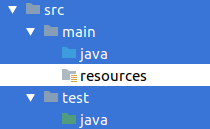
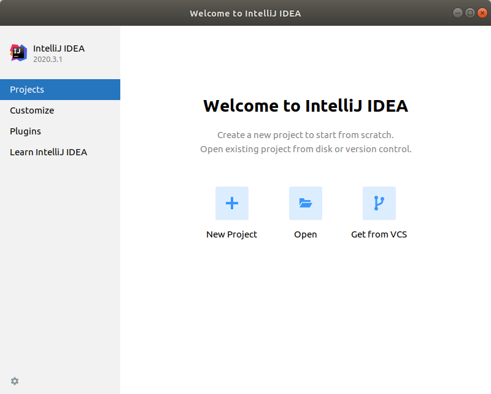
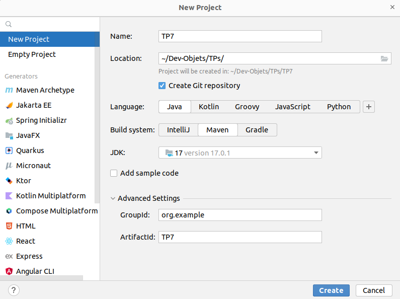
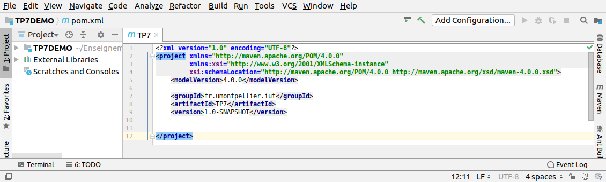
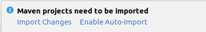

# 

# Développement Orienté Objets

### IUT Montpellier-Sète – Département Informatique

* [**Support de cours**](https://gitlabinfo.iutmontp.univ-montp2.fr/dev-objets/Ressources)
* **Enseignants:**
  [Malo Gasquet](mailto:malo.gasquet@umontpellier.fr),
  [Sophie Nabitz](mailto:sophie.nabitz@univ-avignon.fr),
  [Cyrille Nadal](mailto:cyrille.nadal@umontpellier.fr),
  [Victor Poupet](mailto:victor.poupet@umontpellier.fr),
  [Gilles Trombettoni](mailto:gilles.trombettoni@umontpellier.fr),
  [Petru Valicov](mailto:petru.valicov@umontpellier.fr)
* Le [forum Piazza](https://piazza.com/class/lrahb0patze3u4) de ce cours pour poser vos questions
* [Email](mailto:petru.valicov@umontpellier.fr) pour toute question concernant le cours.

<!--Avant de démarrer le TP, vérifiez que vous n'avez pas atteint votre quota d'espace de stockage autorisé :

* placez-vous dans votre `$HOME` et utilisez les commandes suivantes :
    * `du -sh` pour voir combien d'espace vous avez déjà utilisé
    * `du -sh *` pour voir combien d'espace vous avez déjà utilisé pour chaque fichier (sans fichiers cachés)
    * `du -sch .[!.]* *` pour voir combien d'espace vous avez déjà utilisé pour chaque fichier, y compris les fichiers cachés
* Supprimez les fichiers inutiles.
* Pour éviter des problèmes durant vos TPs d'informatique, vous devriez toujours **garder 300-400 Mo d'espace libre**.
-->

## TP7
#### _Thème : Création d’un projet Java et manipulations de quelques collections_

Date limite de rendu de votre code sur le dépôt GitLab : **dimanche 24 mars à 23h00**

Ce (court) TP a deux buts :

1. Vous apprendre à construire un projet _Java_ avec votre IDE en utilisant une convention standard (ici _Maven_)

2. Reprendre proprement la [Partie 2 du TP6](https://gitlabinfo.iutmontp.univ-montp2.fr/dev-objets/TP6#partie-2-cr%C3%A9ation-dun-framework-de-r%C3%A9solution-de-puzzle) dans ce nouveau projet et améliorer l'efficacité de votre framework de résolution de jeux construit au [TP6](https://gitlabinfo.iutmontp.univ-montp2.fr/dev-objets/TP6), en utilisant les différentes collections vues en [cours](https://www.lirmm.fr/~pvalicov/Cours/dev-objets/Genericite_Structures_de_Donnees_x4.pdf).

Dans tous les cas, désormais le code de votre solution du TP6 devrait rester intact. Dans l'exercice 2, vous allez travailler sur **une copie** du TP6 et vous allez l'améliorer.

### Exercice 1
#### Organisation d'un projet Java - convention Maven

Depuis les premiers TPs de Développement Orienté Objets, nous avons utilisé la convention [Maven](https://fr.wikipedia.org/wiki/Apache_Maven). Pour rappel, voici l'organisation du code dans cette convention :


* l'intégralité des sources du projet se trouve dans le répertoire `src/`
* le code source et fichiers source principaux se trouvent dans `src/main`
* tous les fichiers de tests sont dans `src/test`



* le code source (ou code applicatif) se trouve dans `src/main/java`

* le code source de test se trouve dans `src/test/java`

**Maven** est un system de _build_ et administration de projets Java. Pour faire une analogie vous pouvez le comparer
à l'outil [make](https://fr.wikipedia.org/wiki/Make), qui existe depuis les années '70 et qui est largement utilisé dans
les systèmes de type UNIX. Dans le cas des TPs et projet du cours de Développement Objet, on aurait pu se contenter d'utiliser **make** si l'ensemble des dépendances à gérer n'était pas conséquent et lourd à configurer à la main :
* la version du compilateur _Java_
* la version du byte-code _Java_ généré par le compilateur afin de permettre une compatibilité entre des machines n'ayant pas la même version _Java_
* les différentes librairies de tests unitaires (_Junit 5.9_ actuellement, mais une retro-compatibilité avec _JUnit 4_ parfois est nécessaire)
* etc.

D'autre part, utiliser **make** pour respecter une organisation des répertoires et des packages _Java_ peut s'avérer long.

Pour gérer tous ces aspects, plusieurs outils de _build_ sont recommandés :
* [Maven](https://fr.wikipedia.org/wiki/Apache_Maven),
* [Gradle](https://fr.wikipedia.org/wiki/Gradle),
* [Ant](https://fr.wikipedia.org/wiki/Apache_Ant),
* et bien d'autres.

Dans ce cours le choix a été porté sur *Maven*, mais on aurait pu très bien utiliser un autre outil (de même qu'on aurait pu utiliser _C++_, _C#_ ou encore _Python_ pour vous apprendre à programmer en orienté objet...). Vous avez peut-être
remarqué qu'utiliser *Maven* permet de gérer facilement toutes les dépendances du projet. Le fait que l'ensemble des fichiers sources et exécutables soit organisé et que cette organisation soit faite de manière "transparente" est clairement un bénéfice. Par exemple, vous n'avez pas eu à installer des logiciels spécifiques, autres que votre IDE pour faire fonctionner vos programmes _Java_. Il est également utile pour créer le fichier `.jar` du projet -- une archive contenant l'ensemble de classes _Java_ et de ressources d'un projet informatique (comme `.AppImage` sous Linux ou `.exe` sous Windows).

**Remarque** : L'utilisation de *Maven* est indépendante de votre IDE. Que ce soit [IntelliJ IDEA](https://www.jetbrains.com/idea/),
[Eclipse](https://www.eclipse.org/), ou [NetBeans](https://netbeans.org/), la plupart des IDEs de développement _Java_
ont une intégration facile de *Maven*.

L'objectif de cet exercice est de vous apprendre à construire un projet _Java_ en suivant la convention *Maven*
à partir de rien. Nous allons illustrer les étapes pour [IntelliJ IDEA](https://www.jetbrains.com/idea/),
libre à vous d'adapter ce tutoriel pour un autre IDE que vous préférez.

1. Lancez l'IDE et fermez (si nécessaire) le projet sur lequel vous étiez en train de travailler précédemment.
   Pour ce faire : _File_ &rightarrow; _Close Project_.
   Vous devez vous retrouver avec une fenêtre comme celle-ci :

   

   Cliquez sur _Create New Project_.

2. Une fenêtre de création va apparaître et va rassembler à ceci :

   

   Choisissez _Maven_ comme _Build System_, vérifiez que la JDK correspond à la version _Java 17_ et précisez le répertoire où va résider votre projet.

   Également, dans le menu _Advanced Settings_, vous devez indiquer les informations permettant d'identifier ce projet parmi la liste des projets, que vous avez déjà créés :

    * **GroupId** donne un identifiant à votre projet. Puisque nous construisons un projet _Java_, il faudrait respecter les conventions de nommage du langage. Ici la convention est la même que pour les packages : on indique le domaine dans l'ordre inverse. Par exemple, `org.apache.maven`, `org.apache.commons`. Pour ce TP vous allez choisir `fr.umontpellier.iut`.

    * **artifactId** est le nom de l'exécutable (fichier `.jar`) qui pourra être créé à partir de ce projet." &rightarrow; _Next_
   
    **Important :** Pensez à laisser cochée la case _Create Git repository_.

   Cliquez sur _Create_.

3. Et voilà, vous venez de créer un projet _Java_ en suivant la convention **Maven**. La page que vous allez trouver, va rassembler
   à quelque chose comme ceci :

   

   Notez le fichier XML qui vous sera affiché (`pom.xml`). Ce fichier, appelé
   [_Project Object Model_](https://maven.apache.org/guides/introduction/introduction-to-the-pom.html), contient
   l'ensemble des informations concernant votre projet et sa configuration. C'est ici que seront stockées l'ensemble des
   dépendances de votre projet. Si vous utilisez la version 17 de _Java_, vous pouvez remplir votre `pom.xml` comme suit :

    ```xml
    <?xml version="1.0" encoding="UTF-8"?>
    <project xmlns="http://maven.apache.org/POM/4.0.0"
             xmlns:xsi="http://www.w3.org/2001/XMLSchema-instance"
             xsi:schemaLocation="http://maven.apache.org/POM/4.0.0 http://maven.apache.org/xsd/maven-4.0.0.xsd">
        <modelVersion>4.0.0</modelVersion>
        <groupId>fr.umontpellier.iut</groupId>
        <artifactId>TP7</artifactId>
        <version>1.0-SNAPSHOT</version>
        <properties>
            <maven.compiler.source>17</maven.compiler.source>
            <maven.compiler.target>17</maven.compiler.target>
            <project.build.sourceEncoding>UTF-8</project.build.sourceEncoding>
            <junit.version>5.9.2</junit.version>
        </properties>
        <dependencies>
            <dependency>
                <groupId>org.junit.jupiter</groupId>
                <artifactId>junit-jupiter-engine</artifactId>
                <version>${junit.version}</version>
                <scope>test</scope>
            </dependency>
        </dependencies>
        <build>
            <plugins>
                <plugin>
                    <groupId>org.apache.maven.plugins</groupId>
                    <artifactId>maven-surefire-plugin</artifactId>
                    <version>2.22.0</version>
                </plugin>
                <plugin>
                    <groupId>org.apache.maven.plugins</groupId>
                    <artifactId>maven-failsafe-plugin</artifactId>
                    <version>2.22.0</version>
                </plugin>
            </plugins>
        </build>
    </project>
    ```
   Pour les autres versions de _Java_ il faudra adapter les lignes correspondantes. Il vous est également conseillé de lire la documentation là-dessus :
   * https://maven.apache.org/what-is-maven.html
   * https://maven.apache.org/guides/introduction/introduction-to-the-pom.html

    Après avoir effectué les premières modifications du fichier POM de votre projet, il se peut que votre IDE demande quand est-ce que vous souhaitez qu'il prenne en compte les changements de ce fichier. Ainsi, une fenêtre comme celle-ci pourrait apparaître (en bas à droite de votre écran) :

    

    Si cette fenêtre apparaît, pour faire plus simple, vous pouvez choisir l'option _Enable Auto-Import_ afin que tout changement du fichier POM soit pris en compte immédiatement.

4. Maintenant, que votre projet est prêt, n'oubliez pas de versionner votre travail avec Git. On vous rappelle rapidement les commandes Git à exécuter dans le terminal (attention, si vous utilisez votre IDE pour faire cela, lisez/vérifiez avant de cliquer...) :

   * ajoutez votre dépôt privé distant comme _remote_ : `git remote add origin git@gitlabinfo.iutmontp.univ-montp2.fr:dev-objets/etu/VOTRELOGIN/TP7` (si vous passez par _ssh_)
   * synchronisez le dépôt distant avec votre dépôt local en faisat une fusion (_merge_) avec le dépôt distant :
     * `git pull origin master`
     * `git push --set-upstream origin master`
   * rappelez-vous l'intérêt du fichier `.gitignore` et ajoutez-le à la racine de votre projet. Vous pouvez récupérer un modèle utilisé
     pour un autre TP fait auparavant (par exemple celui du TP6). Pour les utilisateurs des IDEs autres que [IntelliJ IDEA](https://www.jetbrains.com/idea/)
     ([Eclipse](https://www.eclipse.org/), [VSCode](https://code.visualstudio.com/), etc.) il faudra adapter le `.gitignore`.

Désormais tout devrait être fonctionnel et vous pouvez commencer sereinement à créer vos classes _Java_ et programmer comme d'habitude.

### Exercice 2
Comme pour les TPs précédents, pour cet exercice, vous marquerez vos réponses aux questions posées dans un fichier (**reponses.md** par exemple), que vous pouvez déposer à la racine du projet.

Vous avez sans doute remarqué que la résolution des différentes configurations du Taquin (et même Hanoi) est assez lente. Le but de cet exercice est d'améliorer les temps d'exécution de vos algorithmes en choisissant mieux les structures de données, appelées **collections** en _Java_. Pour ce faire, il faut absolument étudier le [cours sur les collections Java](https://www.lirmm.fr/~pvalicov/Cours/dev-objets/Genericite_Structures_de_Donnees_x4.pdf) et lire la documentation dans la littérature ou sur le site d'Oracle. Voici une liste non exhaustive des différentes classes et interfaces que vous devriez connaître après avoir travaillé sur le cours (et la SAE !) :
[Collection](https://docs.oracle.com/javase/8/docs/api/java/util/Collection.html),
[Collections](https://docs.oracle.com/javase/8/docs/api/java/util/Collections.html),
[List](https://docs.oracle.com/javase/8/docs/api/java/util/List.html),
[ArrayList](https://docs.oracle.com/javase/8/docs/api/java/util/ArrayList.html),
[LinkedList](https://docs.oracle.com/javase/8/docs/api/java/util/LinkedList.html),
[Set](https://docs.oracle.com/javase/8/docs/api/java/util/Set.html),
[HashSet](https://docs.oracle.com/javase/8/docs/api/java/util/HashSet.html),
[TreeSet](https://docs.oracle.com/javase/8/docs/api/java/util/TreeSet.html),
[LinkedHashSet](https://docs.oracle.com/javase/8/docs/api/java/util/LinkedHashSet.html),
[Queue](https://docs.oracle.com/javase/8/docs/api/java/util/Queue.html),
[Deque](https://docs.oracle.com/javase/8/docs/api/java/util/Deque.html),
[PriorityQueue](https://docs.oracle.com/javase/8/docs/api/java/util/PriorityQueue.html),
[Map](https://docs.oracle.com/javase/8/docs/api/java/util/Map.html),
[HashMap](https://docs.oracle.com/javase/8/docs/api/java/util/HashMap.html),
[TreeMap](https://docs.oracle.com/javase/8/docs/api/java/util/TreeMap.html), etc.

1. Copiez dans le répertoire `src/main/java` l'ensemble des classes et interfaces métiers créées dans la [Partie 2 du TP6](https://gitlabinfo.iutmontp.univ-montp2.fr/dev-objets/TP6#partie-2-cr%C3%A9ation-dun-framework-de-r%C3%A9solution-de-puzzle). Également, copiez dans le répertoire `src/test/java` l'ensemble de classes de tests. Vérifiez que votre programme principal fonctionne correctement. Pensez à mettre toutes ces classes dans un package approprié. Par exemple `fr.umontpellier.iut` si vous comptez vous arrêtez à l'implémentation des algorithmes de résolution ; et `fr.umontpellier.iut.framework` ou `fr.umontpellier.iut.traitement` si vous voulez ajouter d'autres composants (comme une interface graphique que vous mettriez dans `fr.umontpellier.iut.affichage`).

   **Rappel important** : Le code de votre projet TP6 doit rester intact, seuls les fichiers du TP7 peuvent être modifiés.

2. Observez que jusque-là vous avez utilisée les `ArrayList` de _Java_ pour modéliser les variables `dejaVus`, `frontiere`, ainsi que les fils d'une configuration de jeu donnée (retournés par la méthode `genererFils()` de `JeuPuzzle`). Réfléchissez aux inconvénients de cette structure de données, notamment lorsqu'on ajoute un élément dans `dejaVus` ou `frontiere` ? Est-ce qu'une `ArrayList` est pertinente ici, ou bien choisir une autre collection _Java_ serait plus approprié pour votre algorithme ?

3. Rappelez-vous la spécification de la variable `dejaVus` et notez le test d'appartenance à `dejaVus` dans la méthode `mettreAJour(...)` de la classe `Couple`. De manière directe ou indirecte, pour les `ArrayList` ce test d'appartenance se fait en utilisant la méthode `boolean equals(Object o)` redéfinie dans vos classes `Taquin`, `Hanoi` et `Sudoku`. Proposez une collection plus appropriée pour modéliser la variable `dejaVus` et modifiez (i.e. refactorisez) votre code de façon correspondante. Justifiez votre choix dans le fichier **reponses.md**.

4. Après avoir fait les changements nécessaires, essayez de résoudre les taquins 3 X 3, qui étaient auparavant particulièrement lents et vérifiez si vous obtenez des améliorations des temps de calcul. De même, essayez de voir les améliorations pour le Sudoku et Hanoi.

### Exercice 3

Nous allons maintenant voir comment générer une archive `.jar` contenant les classes compilées de votre programme.
Cette archive peut être utilisée de deux manières :

* Afin de distribuer une **librairie**, utilisable par d'autres programmes (l'archive est importée dans le projet et ses classes sont alors utilisables).

* Afin de distribuer une application. Le fichier jar est alors **exécutable** ainsi :

```bash
java -jar MonApplication.jar
```

Dans cet exercice, nous allons choisir la deuxième option et créer une archive **.jar** à partir de notre projet.

Comme tout bon gestionnaire de projet, **Maven** dispose d'outils (commandes) pour faciliter la création d'une telle archive. Avec **Intellij**, il est possible d'utiliser ces outils via un panneau dédié.

1. Sur **IntelliJ**, ouvre le panneau latéral dédié à **Maven** en cliquant sur le bouton **Maven** en haut à droite de votre interface. Ouvrez ensuite le dossier **Lifecycle**.

    Sur cette interface, on retrouve diverses commandes qui peuvent être exécutées sur le projet, par exemple :

   * `compile` : pour compiler notre code sources en `.class` (qui se retrouvent dans le dossier **target**).

   * `test` : pour exécuter les tests unitaires du projet.

   * `package` : pour créer une archive `.jar` à partir des classes compilées de notre application et des informations contenues dans le fichier **.pom.xml** du projet. Avant d'exécuter cette commande, il faut s'assurer que les classes soient compilées !

    Il est aussi possible d'utiliser directement ces commandes dans un terminal (en se plaçant à la racine du projet) via l'exécutable `mvn`, par exemple :
    
    ```bash
    mvn package
    ```

2. Remaniez le `main` de la classe `AppJeuxPuzzle.java` afin que celui-ci résolve un taquin 3x3 (dont vous préciserez la configuration en dur) et affiche sa solution.

3. Exécutez la commande `compile` puis `package`. Retrouvez l'archive `.jar` générée dans le dossier `target`.

    Le nom de l'archive correspond aux informations que vous avez précisées dans le fichier `pom.xml` :

   * Tout d'abord, on retrouve la valeur de `artifactId` (TP7).

   * Puis, la `version` (pour le moment, `1.0-SNAPSHOT`).

4. Dans un terminal, tentez d'exécuter l'archive **jar** que vous venez de générer. Vous devriez obtenir un message d'erreur.

    Le message d'erreur indique "aucun attribut manifest principal dans TP7-1.0-SNAPSHOT.jar". En résumé, cela signifie que `java` ne sait pas quelle classe il faut exécuter dans votre archive ! C'est-à-dire, celle qui contient le `main`. Quand don distribue une **librairie**, il n'y a pas besoin d'avoir une telle classe, car l'archive a pour but d'être utilisée par d'autres programmes et pas à être exécutée directement. Cependant, quand on distribue une application, il faut donc obligatoirement indiquer ce **point d'entrée**.
    
    En explorant le **contenu** de l'archive, vous pourrez notamment retrouver un fichier `META-INF/MANIFEST.MF`. Ce fichier contient des informations sur l'archive. C'est notamment ici qu'on indique la classe qui doit être exécutée dans le cas où l'archive contient une application.
    
    Au lieu d'indiquer cette classe à la main en modifiant ce fichier, il est possible d'ajouter les informations requises dans notre fichier `pom.xml` qui complètera alors le fichier `MANIFEST.MF` adéquatement lors de la génération de l'archive.

5. Dans le fichier `pom.xml`, ajoutez le code suivant dans la section `<plugins>...</plugins>` :

    ```xml
    <plugin>
        <groupId>org.apache.maven.plugins</groupId>
        <artifactId>maven-jar-plugin</artifactId>
        <configuration>
            <archive>
                <manifest>
                    <addClasspath>true</addClasspath>
                    <mainClass>fr.umontpellier.AppJeuxPuzzle</mainClass>
                </manifest>
            </archive>
        </configuration>
    </plugin>
    ```

    La partie essentielle de ce code est l'attribut `mainClass` : il indique quelle classe doit être exécutée lors de l'exécution de l'archive `.jar`. Comme expliqué précédemment, cette classe doit donc contenir un `main`.

6. Ré-exécutez la commande `package` afin de régénérer l'archive `.jar` de l'application.

7. Explorez de nouveau son contenu, notamment le contenu du fichier `META-INF/MANIFEST.MF` qui contient maintenant une ligne supplémentaire indiquant la classe principale.

8. Dans un terminal, tentez de nouveau d'exécuter l'archive **jar** que vous venez de générer. Cette fois-ci, cela devrait fonctionner !

    Bien sûr, dans son état actuel, notre application est limitée, car le puzzle choisi (et sa configuration) sont codés 'en dur" dans le programme. Idéalement, il faudrait faire intervenir l'utilisateur. Soit par chargements d'options (accessibles dans le tableau de chaines de caractères `args` du `main`, un peu comme en _C_) ou bien en utilisant les entrées/sorties (en utilisant `System.in` avec un `Scanner` ou autre pour les entrées). On pourrait aussi imaginer un système où des puzzles sont chargés à partir de fichier, proposer un menu, etc.

    Note à part : comme notre application affiche des données dans la sortie standard (`Sytem.out`), nous sommes obligés d'exécuter notre archive depuis un terminal pour en observer le déroulement et éventuellement interagir avec lui. Dans le cas d'une application possédant une interface graphique (comme vous allez bientôt le voir dans les cours de [JavaFX](https://gitlabinfo.iutmontp.univ-montp2.fr/ihm/)) il sera aussi possible de simplement double-cliquer sur votre archive (comme un programme "normal") pour l'exécuter et afficher l'interface. En soi, double-cliquer sur l'archive fonctionne aussi avec un programme produisant seulement des affichages en console dans la sortie standard, mais vous ne verrez simplement rien, car le programme ne s'exécutera pas dans un terminal visible.